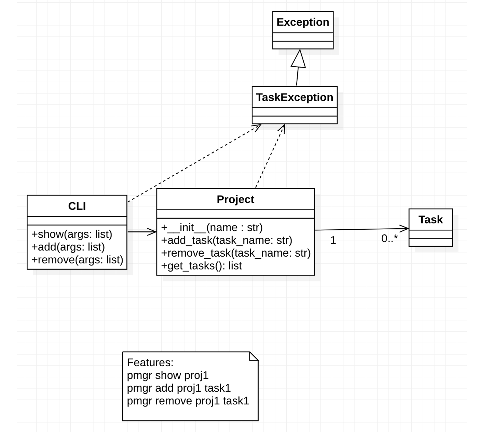

# softeng23-a3

1. In our UML diagram, should Task be a class or should it simply be a string?  Why or why not?
The task should be a string because of what it is currently doing which is passing string.
2. What future enhancements might you add to this project next?  Does the answer to this question change your answer to the first question?
Then after we pass enough tasks, we then create a class which then we could pass in other features to keep track of our tasks. The awnser to this question did not change our awnser for the first one.
